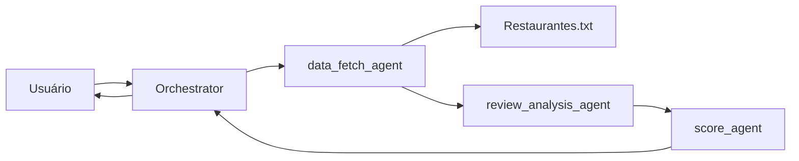

# Desafio – Agentes Conversacionais

Este projeto implementa um sistema **multiagente** para análise de avaliações de restaurantes, conforme desafio técnico proposto.  
O objetivo é processar avaliações textuais, extrair escores e calcular automaticamente uma pontuação final para cada restaurante.

---

## ⚙️ Tecnologias Utilizadas

- **Python 3.11+**
- **autogen** (coordenação dos agentes LLM)
- **regex/json** para parsing e validação
- **logging** para rastreabilidade
- **python-dotenv** para carregar variáveis do `.env`

---

## 🔑 Configuração do `.env`

Crie um arquivo chamado `.env` na raiz do projeto e adicione sua chave da LLM:

```env
OPENAI_API_KEY="sua_chave_aqui"
```
O projeto já carrega automaticamente o `.env` no `main.py`.

---

## 🚀 Execução

### 1. Clonar o repositório
```bash
git clone https://github.com/seu-usuario/agentes-conversacionais.git
cd agentes-conversacionais
```

### 2. Criar ambiente virtual
```bash
python -m venv .venv
source .venv/bin/activate   # Linux/Mac
.venv\Scripts\activate      # Windows
```

### 3. Instalar dependências
```bash
pip install -r requirements.txt
```

### 4. Configurar `.env`
Crie o arquivo `.env` e adicione sua chave conforme explicado acima.

### 5. Rodar o sistema
Exemplo de execução com consulta:
```bash
python main.py "Qual é a avaliação média do Bob's?"
```

Saída esperada:
```
A avaliação média do Bob's é 3.79
```

---

## 🧪 Testes

O arquivo `teste.py` contém testes automatizados fornecidos pelo desafio.  
Execute com:
```bash
python teste.py
```

Saída esperada:
```
Teste 1 Passou. Esperado: 3.79 ...
Teste 2 Passou. Esperado: 6.19 ...
Teste 3 Passou. Esperado: 4.64 ...
Teste 4 Passou. Esperado: 4.64 ...
4/4 Testes Passaram
```

---

## 🔒 Tratamento de Exceções

O sistema **não possui fallback** caso a LLM esteja indisponível.  
Foram implementados tratamentos básicos para:
- Erros de leitura do dataset (`restaurantes.txt`).
- Resposta inválida da LLM (ex.: não-JSON ou fora da escala 1–5).
- Scores inconsistentes.

---

## 📂 Fluxo de Funcionamento



---

## 📌 Exemplo de Perguntas

- `Qual é a avaliação média do Paris 6?`
- `Quão bom é o restaurante KFC?`
- `Qual é a avaliação média do China in Box?`
